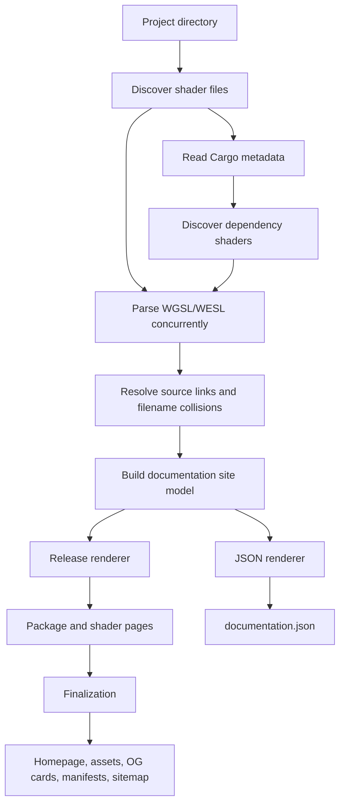
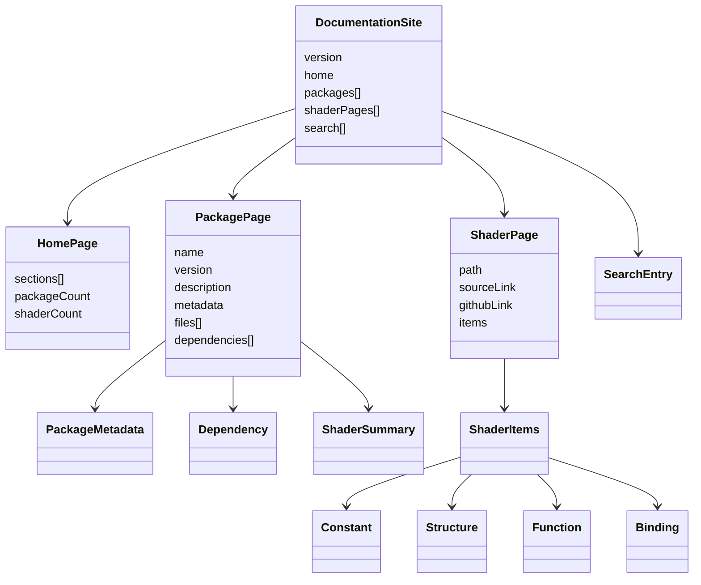

# Shader Explorer

Shader Explorer generates docs.rs-style, searchable HTML documentation for WGSL and WESL shaders. It parses shader declarations, links source locations, and can include shader-bearing Bevy dependencies discovered through Cargo. The default file filter includes both `.wgsl` and `.wesl` files; custom filters remain opt-in.

## Quick start

Generate docs for a project:

```bash
go run . generate --project . --output ./dist
```

Serve the generated site locally:

```bash
just serve
```

The optional `wgsl-docs.toml` file can override the project name, description, output path, exclusions, and dependency discovery settings. Without it, name and description are read from `Cargo.toml` when available.

## CLI

```text
wgsl-docs generate [flags]
  --project PATH       project directory (default: .)
  --output PATH        output directory (default: ./shader-docs)
  --format FORMAT      documentation format: html or json (default: html)
  --exclude PATTERN    exclude a directory or pattern (repeatable)
  --no-deps            disable Cargo dependency shader discovery
  --offline            use Cargo metadata without network access
  --site-url URL       public origin for canonical URLs and sitemap
  --skip-catalogue     render release pages without catalogue-wide finalization
```

The catalogue matrix uses a two-phase workflow. Release passes write package
and shader pages plus per-release registry fragments; one finalization pass
merges the catalogue, copies shared assets, and writes the homepage, OG card,
manifests, `robots.txt`, and the sitemap:

```bash
wgsl-docs finalize --output ./dist --site-url https://shaders.example.com
```

`just generate-all` runs this release/finalization workflow automatically.
Parser models are cached outside `dist` using source-content and link-settings
digests, so repeated matrix runs reuse unchanged shader parses safely.

### Search-engine indexing

HTML generation adds unique titles and descriptions, canonical URLs, Open Graph
and Twitter metadata, and JSON-LD structured data to the homepage, package
pages, and shader pages. It also writes `robots.txt` and, when a public origin
is configured, an absolute `sitemap.xml` containing every generated HTML page.
Social preview cards are generated under `public/og/`: one site card and one
package/version card, reused by that package's shader pages. PNG cards are
rendered with `resvg` when available; otherwise the generator keeps an SVG
fallback. The homepage uses the repository mascot artwork (`mascot2.jpeg`) as
its social preview image.

For normal project generation, set the public origin in `wgsl-docs.toml`:

```toml
site_url = "https://shaders.example.com"
```

For CI or Vercel builds, set the `SITE_URL` environment variable instead. The
same value is used for canonical links and the sitemap URL. After deployment,
verify the domain in Google Search Console and submit `/sitemap.xml`.

The bundled multi-source build reads the same setting from the top level of
`shader-sources.toml`.

Use `--format json` to export the same home, package, and shader page model
without rendering HTML. The convenience recipe is:

```bash
just generate-json ./path/to/project ./dist
```

It writes `dist/documentation.json`.

## Generation pipeline

Each generation run processes one explicit project directory:

1. The generator discovers `.wgsl` and `.wesl` files and optional Cargo
   dependency shader sources.
2. Files are parsed concurrently, source paths and GitHub links are resolved,
   and filename collisions are disambiguated.
3. Parsed declarations, package metadata, dependencies, links, and search
   entries are assembled into one renderer-neutral documentation model.
4. The selected renderer writes either the HTML site or
   `documentation.json` from that same model.

The HTML renderer writes package and shader pages plus search and version
manifests. JSON mode is optional: `documentation.json` is written only when
`--format json` is selected, and that mode does not render HTML pages.

### Processing flow



### Documentation model

The renderers consume the same model. JSON mirrors this structure; it is not a
direct dump of parser internals.



`just generate-json` requires a project path deliberately. The repository
root is not a package; use a concrete source checkout such as
`./sources/bevy/0.19.1`. The catalogue workflow is separate: `just clone-all`
fetches the configured sources and `just generate-all` processes the matrix
into `dist/`.

For the bundled Bevy catalogue, `just generate-all` clones the configured source revisions into `sources/` and writes the site to `dist/`. `just deploy-prod` deploys the existing `dist/` output without regenerating it.

The source matrix is defined in `shader-sources.toml`. Run `go run ./cmd/wgsl-docs-build --config path/to/matrix.toml clone` or `generate` to use another release matrix.

## Add a library to the catalogue

Add a `[[sources]]` entry to `shader-sources.toml`. The `root` is where
sources are cloned, and `repo` is used for source links in the generated
pages. Use `versions` with `ref_pattern` when releases follow a predictable
tag convention:

```toml
[[sources]]
name = "bevy_hanabi"
repo = "https://github.com/djeedai/bevy_hanabi.git"
root = "sources/hanabi"
ref_pattern = "v{version}"
versions = ["0.15.0", "0.16.0", "0.17.0", "0.18.0", "0.19.0"]
```

For a project with unusual tags, keep the common pattern and override only
the releases that differ:

```toml
[[sources]]
name = "my-shader-library"
repo = "https://github.com/example/my-shader-library.git"
root = "sources/my-shader-library"
ref_pattern = "v{version}"
versions = ["1.2.0", "1.3.0"]

[[sources.releases]]
version = "1.3.0"
ref = "release-1.3"
```

Then fetch and generate the catalogue:

```bash
just clone-all
just generate-all
```

This is the same pattern used for adding third-party Bevy shader projects;
the generated pages include package versions, shader modules, metadata, and
links back to the original repository.

If you would like a library added but do not want to edit the configuration,
open an issue with its repository and release information. I will most likely
prepare and submit the PR for you.

## License

Shader Explorer is dual-licensed under the [MIT License](LICENSE-MIT) or
the [Apache License 2.0](LICENSE-APACHE), at your option.

Generated documentation may include WGSL files from third-party projects;
those files remain under their original licenses.
